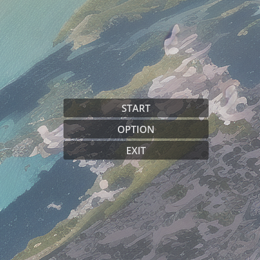

# Godot_4.0_MainMenu
A simple Main Menu for godot 4.0



# Notes
A `settings.cfg` will be create with defaults resolution,

Load you scene on : 
```gdscript
_on_start_button_pressed():
```
## TODO :

- Graphics settings on Editor 
    - Vsync
    - AA
- Singleton to track settings across the project